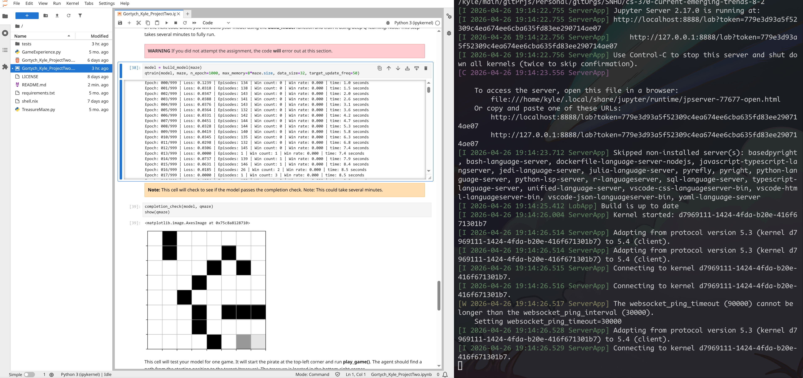

<div align="right">
 


</div>

# cs-370-current-emerging-trends-8-2
Project work from Current and Emerging Trends in CS 


## About
This Jupyter Notebook project shows the implementation of the Q-training algorithm to solve a maze.
Results have been exported to an html file.

## Motivation
To show the work done in CS 370 current and emerging trends in CS from SNHU.

## Getting Started
Setup is done via `git clone url`.

## Installation

### Tools
Installation best via a system level package manager or ephemeral build environment.
Transitvie dependecies such as language are shown via tree level.

- git
- python
- numpy 
- tensorflow 
- keras 
- matplotlib 
- ipykernel 
- jupyterlab

## Reflection

### Briefly explain the work that you did on this project: What code were you given? What code did you create yourself?
I implmented the Q-training algorithm within the qtrain function. I was given pseudo code and implemnted it by first using a for-loop for epoch with in the range n_epoch. Within the for-loop it was important to initialize the current state of the game and use a nested while loop to preform the checks via if else.

### Connect your learning from throughout this course to the larger field of computer science:
- **What do computer scientists do and why does it matter?**
Computer scientists use principals of software engineering and mathamatics to provide both automated and manual solutions to complex problems.

- **How do I approach a problem as a computer scientist?**
I approach a problem as a computer scientist by first defining the functional and non functional requrienments and establish per and post conditions. The Next step I take is to see what libraries, frameworks, and tools I can use to resolve the problem and optimize the design.

- **What are my ethical responsibilities to the end user and the organization?**
My ethical responsibilities to the end user and organization is to ensure transparency via design by contract, minimize bias, and follow best security practices.

## TODO requirement 

<details>
<summary>Click to see</summary>

```txt
Set the initial environment state
env_state should reference the environment's current state
Hint: Review the observe method in the TreasureMaze.py class.

While game status is not game over:
   previous_envstate = env_state
    Decide on an action:
        - If possible, take a random valid exploration action and 
          randomly choose action (left, right, up, down)
          and assign it to an action variable
        - Else, pick the best exploitation action from the model and assign it to an action variable
          Hint: Review the predict method in the GameExperience.py class.

   Retrieve the values below from the act() method.
   env_state, reward, game_status = qmaze.act(action)
   Hint: Review the act method in the TreasureMaze.py class.

    Track the wins and losses from the game_status using win_history 
 
   Store the episode below in the Experience replay object
   episode = [previous_envstate, action, reward, envstate, game_status]
   Hint: Review the remember method in the GameExperience.py class.

   Train neural network model and evaluate loss
   Hint: Call GameExperience.get_data to retrieve training data (input and target) 
   and pass to the train_step method and assign it to batch_loss and append to the loss variable

If the win rate is above the threshold and your model passes the completion check, that would be your epoch.
```

</details>

### Implemented code

<details>
<summary>Click to see</summary>

```python
def qtrain(model, maze, **opt):
    # exploration factor
    global epsilon

    # Number of epochs
    n_epoch = opt.get('n_epoch', 15000)

    # Maximum memory to store episodes
    max_memory = opt.get('max_memory', 1000)

    # Maximum data size for training
    data_size = opt.get('data_size', 50)

    # Frequency of target network updates
    target_update_freq = opt.get('target_update_freq', 50)

    # Start time
    start_time = datetime.datetime.now()

    # Construct environment/game from numpy array: maze (see argument above)
    qmaze = TreasureMaze(maze)

    # Target Network to better guide training
    target_model = clone_model(model)
    target_model.set_weights(model.get_weights())

    # Initialize experience replay object
    experience = GameExperience(model, target_model, max_memory=max_memory)

    win_history = []                  # history of win/lose game
    hsize = qmaze.maze.size // 2      # history window size
    win_rate = 0.0

    # =============START_HERE================
    for epoch in range(n_epoch):
        loss = 0.0
        # Picks a random free cell as the starting point for the pirate
        agent_cell = random.choice(qmaze.free_cells)
        qmaze.reset(agent_cell)

        # Sets the initial state
        env_state = qmaze.observe()

        n_episodes = 0
        game_over = False

        # While game status is not game over
        while not game_over:
            previous_envstate = env_state

            # Get the list of valid actions from the current cell
            valid_actions = qmaze.valid_actions()
            if not valid_actions:
                # No valid moves then is a loss and exit this episode
                break

            # Decide on an action, explore or exploit
            if np.random.rand() < epsilon:
                # Randomly choose a valid action
                action = random.choice(valid_actions)
            else:
                # Picks the best action predicted by the model
                action = int(np.argmax(experience.predict(previous_envstate)))

            # Apply the action, get the new state, reward, then game status
            env_state, reward, game_status = qmaze.act(action)

            # Track wins and losses
            if game_status == 'win':
                win_history.append(1)
                game_over = True
            elif game_status == 'lose':
                win_history.append(0)
                game_over = True
            else:
                game_over = False

            # Store the episode in the Experience replay object
            episode = [previous_envstate, action, reward, env_state, game_status]
            experience.remember(episode)
            n_episodes += 1

            # Train the neural network model and evaluate loss
            # trained every 4 steps for speed
            if n_episodes % 4 == 0:
                inputs, targets = experience.get_data(batch_size=data_size)
                batch_loss = train_step(inputs, targets)
                loss += float(batch_loss)

        # Updates the target network every target_update_freq epochs
        if epoch % target_update_freq == 0:
            target_model.set_weights(model.get_weights())

        # Compute the rolling win rate over the last hsize games
        if len(win_history) > hsize:
            win_rate = sum(win_history[-hsize:]) / hsize

        dt = datetime.datetime.now() - start_time
        t = format_time(dt.total_seconds())
        template = ("Epoch: {:03d}/{:d} | Loss: {:.4f} | Episodes: {:d} | "
                    "Win count: {:d} | Win rate: {:.3f} | time: {}")
        print(template.format(epoch, n_epoch - 1, loss, n_episodes,
                              sum(win_history), win_rate, t))

        # If the win rate hits 100% AND the model passes completion_check,
        # then converged there fore the final epoch
        if win_rate >= 1.0 and completion_check(model, qmaze):
            print("Reached 100%% win rate at epoch: %d" % (epoch,))
            break
    # =============End_HERE================

    # Determine the final epoch and total training time
    dt = datetime.datetime.now() - start_time
    seconds = dt.total_seconds()
    t = format_time(seconds)

    print('n_epoch: %d, max_mem: %d, data: %d, time: %s' %
          (epoch, max_memory, data_size, t))
    return seconds


# This is a small utility for printing readable time strings:
def format_time(seconds):
    if seconds < 400:
        s = float(seconds)
        return "%.1f seconds" % (s,)
    elif seconds < 4000:
        m = seconds / 60.0
        return "%.2f minutes" % (m,)
    else:
        h = seconds / 3600.0
        return "%.2f hours" % (h,)
```

</details>

### screenshot

<div align="center">
  
</div>
